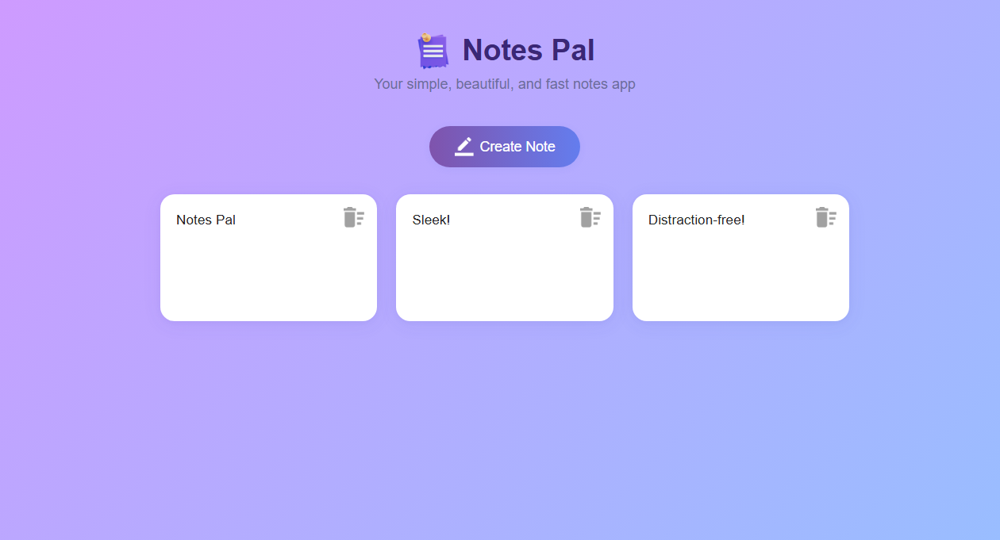

# Notes Pal

## Screenshots

 <!-- Add a screenshot if available -->

Notes Pal is a simple, beautiful, and fast web-based notes app. Effortlessly create, edit, and delete notes right in your browser. All your notes are stored locally and persist between sessions, ensuring privacy and instant access.

## Features

- **Create** new notes with a single click
- **Read** and view all your notes in a clean, responsive grid
- **Update** notes instantly by editing them inline
- **Delete** notes with a single click
- **Responsive design** for desktop and mobile
- **Modern, intuitive UI** with smooth transitions

## Getting Started

1. **Clone or download this repository**
2. Open `index.html` in your web browser

No installation or backend required—everything runs locally in your browser.

## Project Structure

```
Notes_Pad/
├── images/         # App icons and images
├── index.html      # Main HTML file
├── style.css       # App styling
├── script.js       # App logic
└── README.md       # This file
```


## License

This project is open source and free to use.

---

**Enjoy taking notes with Notes Pal!**